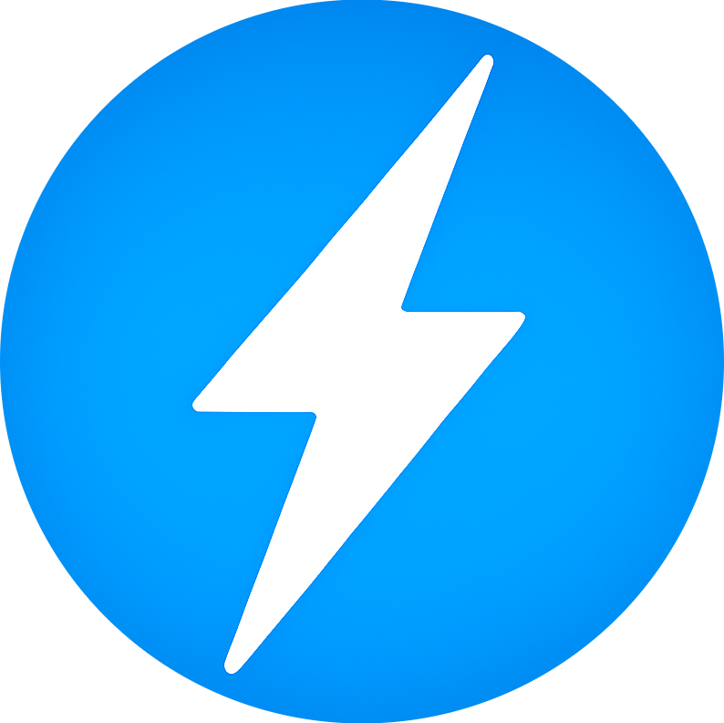

<p align="center">
  
</p>

<h1 align="center">⚡ Smart Meter App</h1>
<p align="center">

A Flutter mobile application for monitoring real-time energy consumption with live charts and daily analytics.
</p>

## Features

- Live energy monitoring with real-time charts
- Daily power usage analytics
- User authentication with Firebase
- Profile management with custom images
- Dark mode UI

## Setup

1. Install Flutter SDK from https://flutter.dev/docs/get-started/install

2. Clone and install dependencies:
```powershell
flutter pub get
```

3. Add Firebase config:
- Put `google-services.json` in `android/app/`
- Add `GoogleService-Info.plist` for iOS/macOS

4. Run the app:
```powershell
flutter run
```

## Architecture

- Firebase Authentication for user management
- RESTful API for meter data
- Riverpod for state management
- Local storage for user preferences


